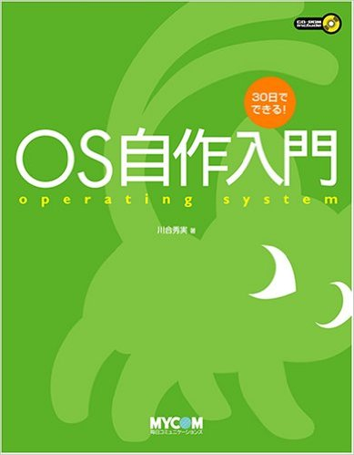

# gxyos

**Xiaoyong Guo**

Source code in this project is from Hidemi Kawai's book [_How to build an operating system in 30 days_](https://www.amazon.com/x65E5-x3067-x304D-x308B-x81EA/dp/4839919844?ie=UTF8&*Version*=1&*entries*=0) with minor modifications. I learned basics about x86 ISA and ld link script by doing this project.   

## Build
Compilation can only be done under Linux. This project uses nasm and gcc instead of the assembler and compiler provided along Hidemi Kawai's book. PHP is also required.

